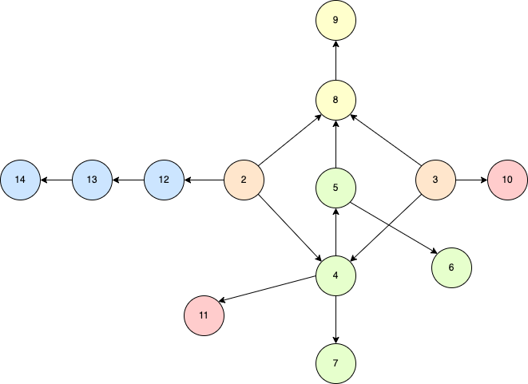

# Machine Learning pour l'économétrie

Repo associé au manuel "Machine Learning pour l'économétrie" : https://www.economica.fr/machine-learning-pour-leconometrie-c2x40149680

*Machine learning pour l’économétrie* est un ouvrage destiné aux économistes qui souhaitent appréhender les techniques de machine learning modernes – de leurs performances en matière de prédiction au traitement révolutionnaire des données non structurées – afin d’établir des relations de causalité à partir des données.

Il aborde la sélection automatique de variables dans divers contextes de grande dimension, l’estimation de l’hétérogénéité des effets du traitement, les techniques de traitement du langage naturel (NLP), ainsi que le contrôle synthétique et les prévisions macroéconomiques.

Les fondements des méthodes de machine learning sont introduits de manière à proposer à la fois un traitement théorique approfondi de la façon dont elles peuvent être utilisées en économétrie, ainsi que de nombreuses applications économiques. Chaque chapitre contient une série d’exemples empiriques, de programmes et d’exercices pour faciliter l’adoption et la mise en œuvre des techniques par le lecteur.

Ce livre s’adresse aux étudiants de master ou de grandes écoles, aux chercheurs et aux praticiens désireux de comprendre et perfectionner leur connaissance du machine learning pour l’appliquer dans un contexte traditionnellement réservé à l’économétrie.

* * *

[Christophe GAILLAC](https://www.cgaillac.com/) est chercheur à l’Université d’Oxford.

[Jérémy L’HOUR](https://sites.google.com/site/jeremylhour/home) est chercheur chez Capital Fund Management (CFM).

Tous deux sont Administrateurs de l’Insee, chercheurs affiliés au Centre de Recherche en Économie et Statistique (CREST) – Institut Polytechnique de Paris, et ont enseigné le cours de Machine learning pour l’économétrie à l’ENSAE Paris pendant plusieurs années.

* * *

# Table des matières

1. Introduction

PARTIE I : Prérequis statistiques 

2. Outils statistiques
3. Prérequis sur l'inférence causale

PARTIE II : Grande dimension et sélection de variables

4. Grande dimension, sélection de variables et inférence post-sélection
5. Généralisation et méthodologie
6. Grande dimension et endogénéité : variables instrumentales
7. Pour aller plus loin

PARTIE III : Hétérogénéité des effets du traitement

8. Inférence sur les effets hétérogènes du traitement
9. Apprendre la politique optimale

PARTIE IV : Effets agrégés et prévision macroéconomique

10. La méthode du contrôle synthétique
11. Prévision macroéconomique en grande dimension

PARTIE V : Économétrie des données textuelles, traitement du langage naturel

12. Travailler avec des données textuelles
13. Représentation distribuée des mots
14. Apprentissage supervisé : codage automatique et appariement

PARTIE VI: Exercices

15. Exercices

* * *

# Liens entre chapitres

Afin d'aider le lecteur à se repérer dans cet ouvrage, la figure suivante donne le lien entre chaque chapitre désigné par son numéro. Une arrête allant d'un noeud vers un autre indique que le chapitre d'origine est un pré-requis pour comprendre le chapitre de destination. Outre les chapitres 2 et 3 qui ne constituent pas le coeur du propos, le lecteur peut commencer par les chapitres 4, 8, 12 qui sont les premiers chapitres des deuxième, troisième, et cinquième parties respectivement, ou bien par l'un des deux chapitres de la quatrième partie.

* * *

# Eléments de correction

Des élements de correction pour les problèmes présentés au chapitre 15 se trouvent dans le dossier [ch15_exercices](https://github.com/jeremylhour/ml_econometrie/tree/main/ch15_exercices/), et des éléments de correction pour les questions de fin de chapitre se trouvent dans le dossier [answers](https://github.com/jeremylhour/ml_econometrie/tree/main/answers/).

* * *

# Contacts

Pour une question sur l'ouvrage en lui-même, le plus simple est d'ouvrir un sujet à la section [<< Issues >>](https://github.com/jeremylhour/ml_econometrie/issues) de ce repo git. Du reste, le mode de contact se trouve sur le site de chaque auteur: [lien vers le site de Christophe](https://www.cgaillac.com/), [lien vers le site de Jérémy](https://sites.google.com/site/jeremylhour/home).
